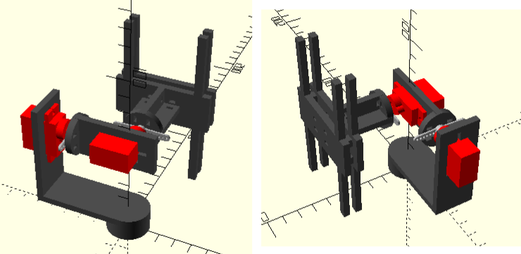

# Open Source Gimbal with Servomotor

**This is an experimental project.** The servomotors used are slow and are not strong enough to support a device like a smartphone. The movement is shaky and unstable. **Do not use this project for commercial purposes.**

The course in which this work was presented has already ended. We were approved :)

## Hardware

* 1x BluePill board (STM32F103C8 microcontroller) 
* 4x 2N7000 MOSFET
* 6x 1K resistors
* 2x 100K resistors
* 2x Tower Pro MG90S servomotors
* 1x MPU6050 3-axis gyroscope accelerometer

## Firmware

* C language
* **STM32CubeMX** generated HAL
* Compiled with **arm-none-eabi-gcc**
* Makefile toolchain
* No RTOS
* MCU Flashing with **st-link** device and **st-flash** (Linux) software

## Behaviour
* Information about the MPU6050's position is obtained 200 times per second **(TIM4 IRQ)**.
* Servomotors position is updates 50 times per second **(TIM3 IRQ)**.
* UART messages are sent periodically **(TIM2 IRQ)**.
* In the event of a failure, the ERROR led wil blink and the MCU will reset.

## Physical structure 

3D printed structure:

3D models made in **OpenSCAD**. The model of each piece is in the **'structures'** directory. Models are scaled to **one millimeter per unit**. It is necessary to use glue and nylon-cable-ties to fix some parts to the structure.

The pieces are as follows:

* **pitch_holder**:
This piece is the basis of the entire structure. It holds the pitch-servomotor and has a small cylinder at the base that can be attached to an aluminum pipe.

* **pitch_base**:
This part holds the roll-servomotor. It must have its cylindrical base fixed to the pitch-servomotor horn.

* **roll_base**:
This structure must hold the device_holder. Its cylindrical base must be fixed to the roll-servomotor horn.

* **device_holder** and **device_holder_2**:
These structures must support a mobile device that is not too heavy. Both must be attached to each other with the small spacers between them.

* 2x **device_clamp**:
Two prints of this structure must pass through the device_holder's sticks. They serve to hold the device to the structure.
